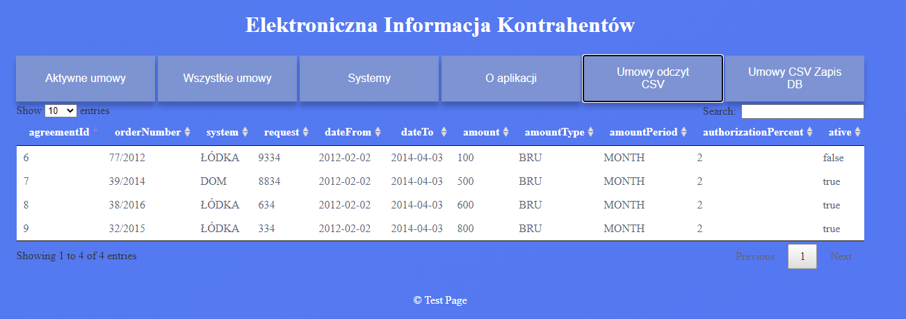

#Electronic Information of Contractors
> Simple example of full front-end and back-end application

## Table of contents
* [General info](#general-info)
* [Screenshots](#screenshots)
* [Technologies](#technologies)
* [Setup](#setup)
* [Features](#features)
* [Status](#status)
* [Inspiration](#inspiration)
* [Contact](#contact)

## General info
The purpose of this exemplary application is to check how the flow of data works 
from http threw java app to MySql database. The application contains the functionality 
to load .csv file from a folder contained in the project tree. 

## Screenshots

## Technologies
* SpringBoot
* Maven 3.6.3
* MySQL Community Server 8.0.23
* Apache Tomcat 9
* JUnit 4
* Apache Tiles 3.0.8

## Setup
1. Create Data Base schema `eik`
2. Input commands to MySQL Database from Sql.txt file under the SamspleData folder
3. Under project `src/resources` input login data 
   `spring.datasource.username=***`
   `spring.datasource.password=***` 
   DB port number.
4. Build project with `mvn install` command.
5. Check if endpoint in Tomcat settings is the same as endpoint variable under
   `webapp\resources\default.js`
6. Start Tomcat Server with port number 8080

## Features
List of features ready:
* Read and Writ to MySql database with use of HIBERNATE
* Read a .csv file and save that data to Database
* Filter types of contracts

To-do list:
* Code refactor

## Status
Project is: _finished_?

## Inspiration
The project was inspired by testing purposes of checking how Apache Tiles works.

## Contact
Created by [@AdamSobieraj](https://github.com/AdamSobieraj) - feel free to contact me!